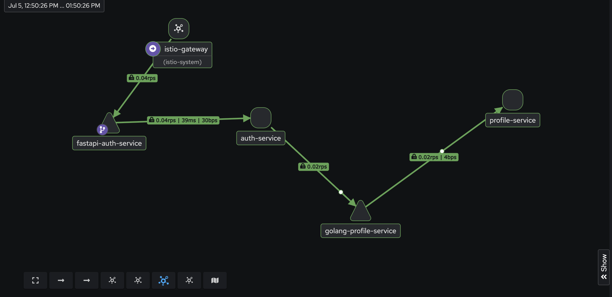
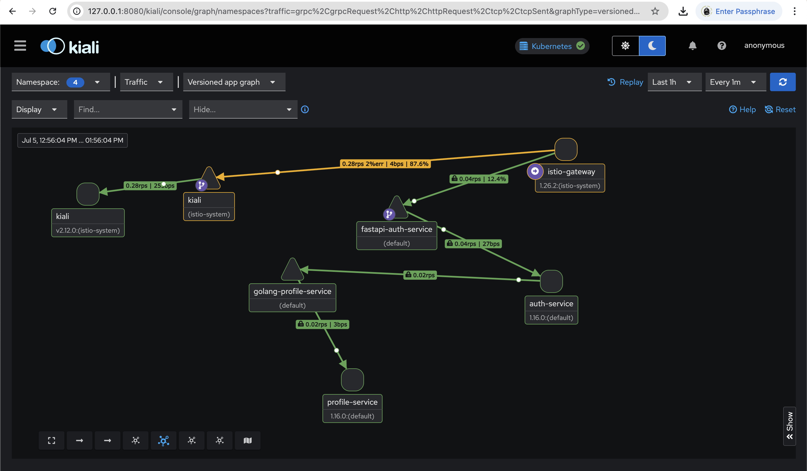
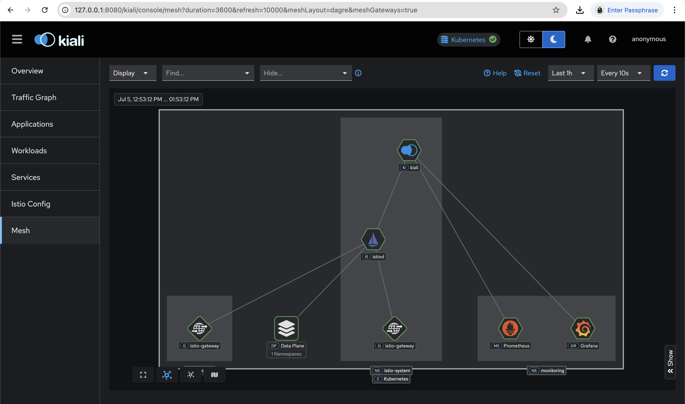

<p align="center">
  
  
</p>

<h1 align="center">Kubernetes Istio Service Mesh With Kiali Console</h1>

<p align="center">
  <a href="https://github.com/batpool/kubernetes-istio-service-mesh/actions?query=workflow%3ACI+branch%3Amain">
    
  </a>
  <a href="https://github.com/batpool?tab=packages&repo_name=kubernetes-istio-service-mesh">
    
  </a>
  <a href="https://github.com/batpool/kubernetes-istio-service-mesh/blob/master/LICENSE">
    
  </a>
  <a href="https://github.com/batpool/kubernetes-istio-service-mesh/blob/master/CODE_OF_CONDUCT.md">
    
  </a>
  <a href="https://github.com/batpool/kubernetes-istio-service-mesh/blob/master/SECURITY.md">
    
  </a>
</p>

<p align="center">
  
  
  
  
  
  
  
  
  
  
  
  
  
  
  
  
</p>

<details>
<summary><strong>📁 Table of Contents</strong></summary>

- [Screenshot Kiali](#-screenshot-kiali)
- [Step-by-Step Installation](#%EF%B8%8F-step-by-step-installation-guide)
  - [Clone the Repository](#-clone-the-repository)
  - [Create Kind Cluster](#-create-kind-cluster)
  - [Add Istio and Install Components](#-add-istio-helm-repo-and-install-components)
  - [Enable Istio Injection](#-enable-istio-injection)
  - [Install Istio Gateway](#-install-istio-gateway)
  - [Monitoring Setup](#-monitoring-setup)
  - [Kiali Dashboard](#-kiali-dashboard)
  - [Install Microservices](#%EF%B8%8F-install-microservices)
- [Security](SECURITY.md)
- [Code of Conduct](CODE_OF_CONDUCT.md)
- [License](LICENSE)
- [GitHub Packages](https://github.com/batpool?tab=packages&repo_name=kubernetes-istio-service-mesh)

</details>

---

## 📊 Screenshot Kiali




## 🛠️ Step-by-Step Installation Guide

### 🧬 Clone the Repository

Start by cloning the project to your local machine:

```bash
git clone https://github.com/batpool/kubernetes-istio-service-mesh.git
cd kubernetes-istio-service-mesh
```

### 🧱 Create Kind Cluster

```bash
kind create cluster --config kind/config.yaml --name dev
```

### 📦 Add Istio Helm Repo and Install Components

```bash
helm repo add istio https://istio-release.storage.googleapis.com/charts

helm install istio-base istio/base -n istio-system --create-namespace --wait
helm install istiod istio/istiod -n istio-system --wait
```

### 🔧 Enable Istio Injection

```bash
kubectl label ns default istio-injection=enabled --overwrite
kubectl wait pods --for=condition=Ready -l app=istiod -n istio-system
```

### 🌐 Install Istio Gateway

```bash
helm install istio-gateway istio/gateway -n istio-system \
  --set "service.type=NodePort" \
  --set "service.ports[0].name=http2" \
  --set "service.ports[0].port=80" \
  --set "service.ports[0].nodePort=30000" \
  --set "service.ports[1].name=https" \
  --set "service.ports[1].port=443" \
  --set "service.ports[1].nodePort=31000" \
  --set "service.ports[2].name=status-port" \
  --set "service.ports[2].port=15021" \
  --set "service.ports[2].targetPort=15021" \
  --set "service.ports[2].nodePort=32000"

kubectl apply -f istio/servicemesh/gateway.yaml
```

### 📈 Monitoring Setup

```bash
helm repo add prometheus-community https://prometheus-community.github.io/helm-charts

helm install prometheus prometheus-community/prometheus -n monitoring --create-namespace

```

### 📊 Kiali Dashboard

```bash
helm install kiali-server kiali-server \
  --repo https://kiali.org/helm-charts \
  --namespace istio-system \
  --create-namespace \
  --set auth.strategy="anonymous" \
  --set external_services.prometheus.url="http://prometheus-server.monitoring" \
  --set external_services.grafana.enabled=false
```

### ⚙️ Install Microservices

```bash
helm install fastapi-auth-service ./helm-charts/fastapi-auth-service

helm install golang-profile-service ./helm-charts/golang-profile-service
```

---

✅ Now you’re ready to visualize your Istio Service Mesh with **Kiali**, **Prometheus** – all running on a local **Kind** cluster!

> 🌟 *Don’t forget to give a ⭐ on GitHub if you find this project helpful!*